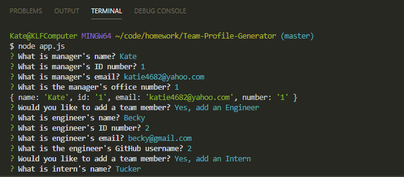
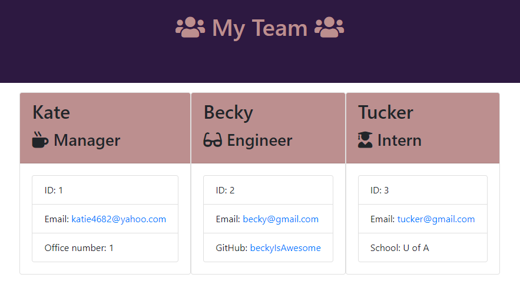
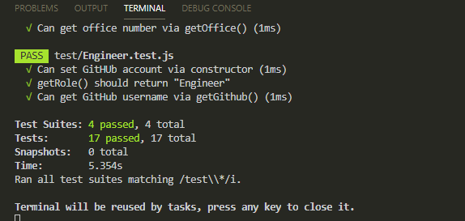

# Team Profile Generator

  ## Description
  This is a software engineering team generator command line application. The application prompts the user (manager) for information about the team. When the user completes building the team, the application creates  a html file that displays a nicely formatted team roster based on the info provided by the user.

  

  ## Table of Contents
  * [Installation](#installation)
  * [Usage](#usage)
  * [License](#license)
  * [Contributing](#contributing)
  * [Tests](#tests)
  * [Questions](#questions) 

  ## Installation
   Open to app.js file.  Open the terminal in the application. Run node app.js.

  ## Usage
  User Story : As a manager,
  I want to generate a webpage that displays my team's basic info
  so that I have quick access to emails and GitHub profiles

  ## License
  © 2020 Kate Meersman brand. All Rights Reserved. 

  ## Contributing
  Kate Meersman

  ## Tests

  

  

  

  

  ## Contact
  * katie4682@yahoo.com